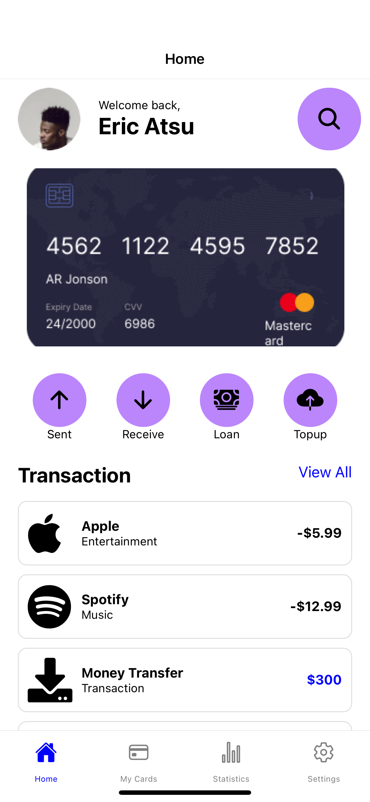

# React Native Financial Dashboard

 It is a React Native financial dashboard app that showcases a user's financial transactions and other related data. The app displays a welcome message, transaction buttons, and a list of recent transactions using custom icons and a themed user interface.

## Features

- Light and Dark mode toggle
- Tab navigation with four main screens
  - Home
  - My Cards
  - Statistics
  - Settings
- Dynamic content display based on the current theme
- Interactive list and buttons

## Screenshots

### Light Mode



### Dark Mode


## Installation

1. Clone the repository:
   ```sh
  https://github.com/codetozombie/rn-assignment5-11227686.git


### Running the App
Android
Make sure you have an Android emulator running or an Android device connected, then run:
```
npx react-native run-android
```

### iOS
Make sure you have Xcode installed, then run:
```
npx react-native run-ios
```

### Expo
Make sure to download the expo go app on your phone
Make sure your phone and laptop are on the same network
```
npm start
```

### Project Structure
.
├── assets
│   └── profile.png
│   └── Card.png
├── screenshots
│   └── light-mode-home.png
│   └── light-mode-settings.png
│   └── dark-mode-home.png
│   └── dark-mode-settings.png
├── src
│   ├── screens
│   │   ├── HomeScreen.js
│   │   ├── MyCardsScreen.js
│   │   ├── StatisticsScreen.js
│   │   └── SettingsScreen.js
│   ├── App.js
├── .gitignore
├── package.json
└── README.md
